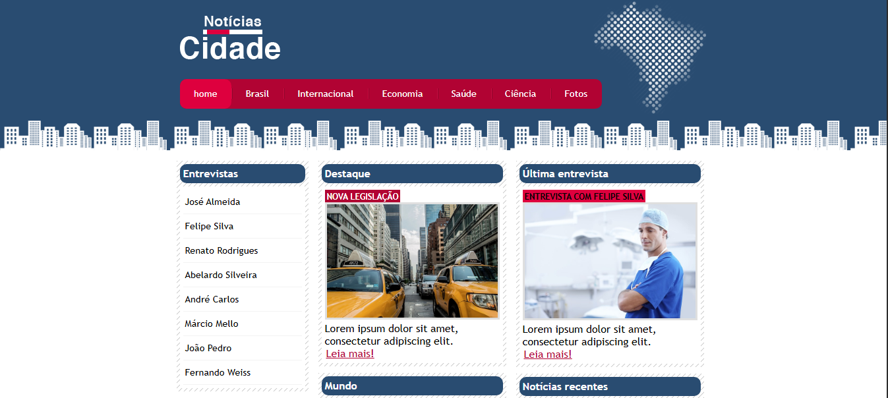

<h2 id="sobre-o-projeto">1. 📰 Notícias Cidade: Portal de Informação 📰</h2>


[](https://github.com/Domisnnet/City-News-Web-Essentials/blob/main/LICENSE)



Bem-vindo ao **Notícias Cidade**! Este projeto simula um portal de notícias completo e dinâmico. A aplicação foca na organização de múltiplas editorias (Brasil, Internacional, Economia, Saúde, etc.) utilizando um layout de múltiplas colunas. É um estudo avançado de posicionamento e containers, ideal para entender como portais de grande conteúdo estruturam suas informações para o usuário final.

---

## 📚 Tabela de Conteúdo

| 📰 O Projeto | 🛠️ Técnico | 🤝 Comunidade |
| :---: | :---: | :---: |
| [](#sobre-o-projeto) | [](#destaques-tecnicos) | [](#codigo-fonte) |
| [](#tecnologias-utilizadas) | [](#instalacao) | [](#créditos) |
| [](#como-acessar) | [](#como-contribuir) | [](#licenca) |
| [](#funcionalidades) | [](#faq) | [](#perfil-do-github) |

---

<h2 id="tecnologias-utilizadas">2. ⚙️ Tecnologias Utilizadas</h2>

| Camada | Tecnologias | Descrição |
| :--- | :--- | :--- |
| **Estrutura** |  | Organização semântica por IDs para controle preciso de layout. |
| **Estilo** |  | Uso intensivo de floats, clears e estilização de listas. |
| **UI/UX** |  | Paleta de cores e tipografia baseada em jornais digitais. |

---

<h2 id="como-acessar">3. 🚀 Como Acessar</h2>

Acesse o portal e navegue pelas notícias em tempo real:

<div align="left">
  <a href="https://domisnnet.github.io/City-News-Web-Essentials/" target="_blank">
    
  </a>
</div>

---

<h2 id="funcionalidades">4. 🧩 Funcionalidades Principais</h2>

O portal oferece uma experiência completa de leitura e interação:

| Funcionalidade | Descrição |
| :--- | :--- |
| 🏠 **Home de Destaques** | Área principal com a notícia mais importante do momento. |
| 📑 **Categorias Variadas** | Menu de navegação que segmenta o conteúdo por temas. |
| 🎙️ **Painel de Entrevistas** | Seção dedicada a conversas com especialistas e personalidades. |
| 📬 **Newsletter (News)** | Formulário de cadastro para recebimento de notícias por e-mail. |
| 🖼️ **Miniaturas de Notícias** | Listas visuais com ícones que facilitam a leitura rápida. |

---

<h2 id="destaques-tecnicos">5. 💻 Destaques Técnicos</h2>

A engenharia deste projeto foca no equilíbrio de colunas:

### 📐 Layout de Três Colunas
O desafio técnico consistiu em equilibrar as divs `#primario`, `#secundario` e `#lateral` para que coexistissem lado a lado, utilizando propriedades de largura percentual e `float: left`.

### 🔄 Limpeza de Fluxo (`Clear`)
Implementação de `clear: both` no rodapé e em containers específicos para garantir que o layout não quebre quando o conteúdo de uma coluna for maior que o da outra.

---

<h2 id="instalacao">6. 🚀 Instalação e Configuração Local</h2>

```bash
# Clonar o repositório
git clone https://github.com/Domisnnet/City-News-Web-Essentials.git(https://github.com/Domisnnet/City-News-Web-Essentials.git)

# Acessar a pasta
cd City-News-Web-Essentials
```

---

<h2 id="como-contribuir">7. 🤝 Como Contribuir</h2>

Siga os passos abaixo para adicionar novas editorias ou melhorias:

| Fase | Ação | Link / Comando |
| :---: | :--- | :--- |
| **01** | **Fork** | [](https://github.com/Domisnnet/City-News-Web-Essentials/fork) |
| **02** | **Branch** | `git checkout -b feature/NovaEditoria` |
| **03** | **Commit** | `git commit -m 'feat: adição da página de tecnologia'` |
| **04** | **Push** | `git push origin feature/NovaEditoria` |
| **05** | **PR** | [](https://github.com/Domisnnet/City-News-Web-Essentials/compare)

### 🐛 Encontrou um problema?
Se algo não estiver funcionando como esperado, não hesite em abrir um chamado:

[](https://github.com/Domisnnet/City-News-Web-Essentials/issues)
[](https://github.com/Domisnnet/City-News-Web-Essentials/issues/new)

---

<h2 id="faq">8. 🧠 Perguntas Frequentes</h2>

<details>
<summary><strong>Por que os links das categorias não carregam ❓</strong></summary>
<p>🔗 <strong>Resposta:</strong> Este é um template estrutural. As páginas individuais (saude.html, ciencia.html, etc.) devem ser criadas seguindo o modelo da <code>index.html</code>.</p>
</details>

<details>
<summary><strong>O formulário de Newsletter envia e-mails ❓</strong></summary>
<p>📧 <strong>Resposta:</strong> Não. É uma interface de front-end. Para funcionar, precisaria de uma integração com serviços como Mailchimp ou um backend em PHP/Node.js.</p>
</details>

<details>
<summary><strong>Como alterar a cor do topo ❓</strong></summary>
<p>🎨 <strong>Resposta:</strong> Basta editar o seletor <code>#topo</code> no arquivo <code>css/estilo.css</code> e modificar a propriedade <code>background</code>.</p>
</details>

---

<h2 id="codigo-fonte">9. 💻 Código Fonte</h2>

Analise a folha de estilo e a estruturação dos IDs:

[](https://github.com/Domisnnet/City-News-Web-Essentials)


---

<h2 id="créditos">10. 📝 Créditos & Reconhecimentos</h2>

O **Notícias Cidade** reflete as melhores práticas de layouts de portais clássicos:

| Atribuição | Responsável / Recurso | Descrição |
| :--- | :--- | :--- |
| **Dev & Arquitetura** | **DomisDev** | Estruturação de colunas e hierarquia de informação. |
| **Imagens** | **Banco de Imagens** | Fotos ilustrativas (táxi, doutor, tecnologia) para o portal. |
| **Base Teórica** | **Web Layouts** | Estudo de interfaces editoriais de alta densidade. |
| **Apoio Técnico** | **Google Gemini** | Padronização King-Domfy e refinamento documental. |

---

<h2 id="licenca">11. 📄 Licença</h2>

Este projeto está sob a [](https://github.com/Domisnnet/City-News-Web-Essentials/blob/main/LICENSE)

---

<h2 id="perfil-do-github">12. 👨‍💻 Perfil do GitHub</h2>

<a href="https://github.com/Domisnnet"> 
   
</a>
